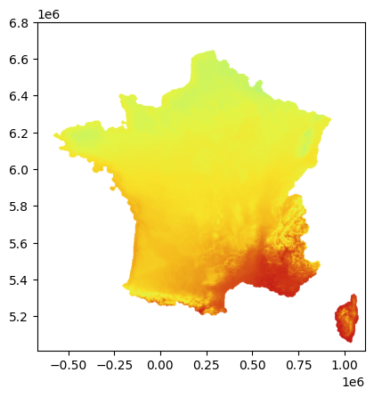
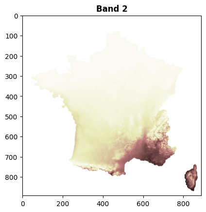
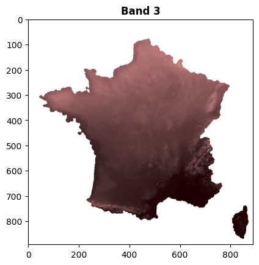

```python
%load_ext autoreload
%autoreload 2
```

# Exploration WMS de la couche potentiel solaire


```python
# Executer ci dessous ci besoin pour récupérer les données
# !extract-sample-data
# Et pour sauver une version markdown des notebooks, utiliser
# jupyter nbconvert wms_potentiel_solaire.ipynb --to markdown --output-dir=exports/
```


```python
from owslib.wms import WebMapService

import geopandas as gpd
import pandas as pd
import matplotlib.pyplot as plt
import contextily as cx
from shapely.affinity import translate
from shapely.ops import unary_union
from shapely import intersection
from pathlib import Path
import numpy as np

import warnings
warnings.filterwarnings('ignore') 
```


```python
import rasterio
from io import BytesIO
from rasterio.plot import show
from rasterio import MemoryFile
from rasterio.plot import show
```


```python
import owslib
owslib.__version__
```


    '0.32.1'


# Récupération data d'une école


```python
DATA_FOLDER = Path("../data")

saint_denis_path = DATA_FOLDER / "saint_denis_reference_data.gpkg"

ecoles = gpd.read_file(saint_denis_path, layer="bdtopo_education").to_crs(2154)
batiments = gpd.read_file(saint_denis_path, layer="bdtopo_batiment").to_crs(2154)

ID = "SURFACTI0000000002555648"

batiments_ecole = batiments[batiments.cleabs_left__zone == ID]
boite = batiments_ecole.geometry.total_bounds
batiments_ecole.plot()
```

# Definitions WMS


```python
# https://geoservices.ign.fr/services-web-experts-energies-renouvelables
# url = 'https://data.geopf.fr/annexes/ressources/wms-r/enr.xml'
url = "https://data.geopf.fr/wms-r/wms?SERVICE=WMS&"
wms = WebMapService(url, version='1.3.0')
layer= 'IRRADIATION.SOLAIRE'
```

# On commence par la France


```python
minx = -667916
maxx = 1113194
miny = 5012341
maxy = 6800125
espg = "3857"
Y = (maxy-miny)//2000
X = (maxx-minx)//2000
print(X,Y)
```

    890 893


```python
img = wms.getmap(layers = [layer], srs = 'EPSG:3857', bbox = [minx,miny,maxx,maxy] , size = (X, Y), format= 'image/geotiff',transparent=True,mode='32bit')
```


```python
with MemoryFile(img) as memfile:
    with memfile.open() as dataset:
        metas = dataset.meta
        show(dataset)
```


    

    


```python
allImgs = []
with rasterio.open(BytesIO(img.read())) as r:
    for k in range(3):
        thing = r.read(k+1)
        allImgs.append(thing)
        show(thing, cmap='pink',title="Band "+str(k+1))
```


    

    


    

    


    

    


```python
metas
```


    {'driver': 'GTiff',
     'dtype': 'uint8',
     'nodata': None,
     'width': 890,
     'height': 893,
     'count': 4,
     'crs': CRS.from_wkt('PROJCS["EPSG:3857",GEOGCS["unknown",DATUM["unnamed",SPHEROID["unnamed",6378137,0]],PRIMEM["Greenwich",0],UNIT["degree",0.0174532925199433,AUTHORITY["EPSG","9122"]]],PROJECTION["Mercator_1SP"],PARAMETER["central_meridian",0],PARAMETER["scale_factor",1],PARAMETER["false_easting",0],PARAMETER["false_northing",0],UNIT["metre",1,AUTHORITY["EPSG","9001"]],AXIS["Easting",EAST],AXIS["Northing",NORTH]]'),
     'transform': Affine(2001.247191011236, 0.0, -667916.0,
            0.0, -2001.9977603583427, 6800125.0)}


On a bien la France mais pas l'échelle.

# Pour l'école


```python
print(boite)

x1new = int(boite[0])
x2new = int(boite[2])

y1new =  int(boite[1])
y2new =  int(boite[3])

X = (x2new - x1new)*5
Y = (y2new - y1new)*5

layer= 'IRRADIATION.SOLAIRE'
#layer= "POTENTIEL.VENT.140M"
imgEcole = wms.getmap(layers = [layer], srs = 'EPSG:2154', bbox = [x1new,y1new,x2new,y2new] , size = (X, Y), format= 'image/geotiff')

with MemoryFile(imgEcole) as memfile:
     with memfile.open() as dataset:
            A = dataset
            show(dataset)
```

    [ 654034.1 6870637.3  654188.6 6870708.4]


    

    

